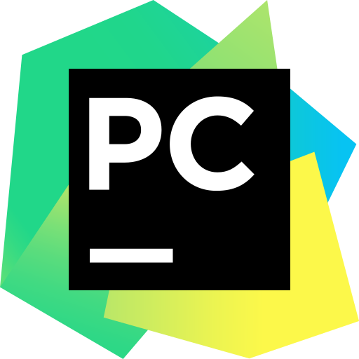

# Hi there 👋 My name is Ivan

## About me:

### I am a student at university from Saint-Petersburg, Russia - SPbPU (Peter the Great St.Petersburg Polytechnic University).

- 🔥 I’m currently working on my own website, Telegram bot to search for tickets for performances and some projects at the university.
- 🌱 I’m currently learning С++, Python, Java Script.
- 📫 How to reach me: email: zolin5269@gmail.com or telegram https://telegram.me/zolin5269
- ⚡ Fun fact: I like to play the piano, take pictures and travel.
___

## Contact with me:
[][linkedin]
[][twitter]
[][instagram]
 
 

## Language and tools:
[][c-programming] 
[][c++] 
[][html5]
[][css3]
[][javascript]
[][python]
[][git]
[][vs]
[][vs-code]
[][py-charm]
[][webstorm]
[][latex]
 
____

<!-- https://github-readme-stats.vercel.app/api/top-langs/?username=anuraghazra&langs_count=8 -->

[linkedin]:https://www.linkedin.com/in/ivan-zolin-4474b0233/
[twitter]:https://twitter.com/zolin5269
[instagram]:https://www.instagram.com/zolin5269/
[c-programming]:https://www.cprogramming.com/
[c++]:https://www.w3schools.com/cpp/default.[html5]asp
[html5]:https://www.w3schools.com/html/
[css3]:https://www.w3schools.com/css/
[javascript]:https://www.w3schools.com/js/
[python]:https://www.python.org/
[git]:https://git-scm.com/
[vs]:https://visualstudio.microsoft.com/
[vs-code]:https://code.visualstudio.com/
[py-charm]:https://www.jetbrains.com/ru-ru/pycharm/
[webstorm]:https://www.jetbrains.com/webstorm/
[latex]:https://www.tug.org/begin.html
<!--
**IMZolin/IMZolin** is a ✨ _special_ ✨ repository because its `README.md` (this file) appears on your GitHub profile.

Here are some ideas to get you started:
 

- 👯 I’m looking to collaborate on ...
- 🤔 I’m looking for help with ...
- 💬 Ask me about ...

- 😄 Pronouns: ...
- 
-->
