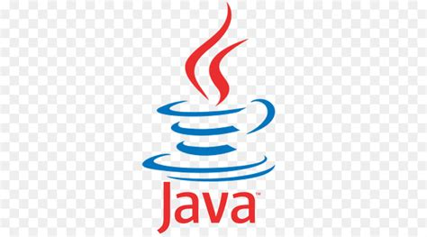
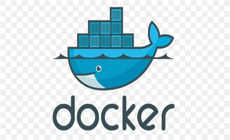

# Hi there 👋 My name is Ivan

## About me:

### I am a student at university from Saint-Petersburg, Russia - SPbPU (Peter the Great St.Petersburg Polytechnic University).

- 🔥 I’m currently working on Culture magazine "[The_Gluck]" to novice journalists, my own [Website], some personal pet projects and some projects at the university.
- ✨I'm currently interesting data science(particularly machine learning), data base and web development.
- 🌱 I’m currently learning Spring, Python, SQL, Java, Java Script.
- 📫 How to reach me: email: zolin5269@gmail.com or telegram https://telegram.me/zolin5269
- ⚡ Fun fact: I like to play the piano, take pictures and travel, play chess, running.
___

## Contact with me:
[][telegram]
<!--  -->
[][linkedin]
[][twitter]
<!-- [][instagram] -->
 

## Languages:
[][c-programming] 
[][c++] 
[][python]
[][matlab]
[][html5]
[][css3]
[][javascript]
[][java]
 

## Tools, databases, frameworks and texnlogies:
[][git]
[][docker]
[][postgres]
[][postman]
[][latex]
[][spring]
[][vue]
[][react]
 
____

## GitHub stats:

<!-- https://github-readme-stats.vercel.app/api/top-langs/?username=anuraghazra&langs_count=8 -->
[The_Gluck]:https://github.com/IMZolin/The-Gluck-magazine
[Website]:https://github.com/IMZolin/Website

[telegram]:https://telegram.me/zolin5269
[linkedin]:https://www.linkedin.com/in/ivan-zolin-4474b0233/
[twitter]:https://twitter.com/zolin5269
[instagram]:https://www.instagram.com/zolin5269/

[c-programming]:https://www.cprogramming.com/
[c++]:https://www.w3schools.com/cpp/default.[html5]asp
[html5]:https://www.w3schools.com/html/
[css3]:https://www.w3schools.com/css/
[javascript]:https://www.w3schools.com/js/
[python]:https://www.python.org/
[matlab]:https://www.mathworks.com/products/matlab.html
[java]:https://www.java.com/ru/

[git]:https://git-scm.com/
[docker]:https://www.docker.com/
[latex]:https://www.tug.org/begin.html
[postgres]:https://www.postgresql.org/
[postman]:https://www.postman.com/
[spring]:https://spring.io/
[vue]:https://vuejs.org/
[react]:https://reactjs.org/

[vs]:https://visualstudio.microsoft.com/
[vs-code]:https://code.visualstudio.com/
[clion]:https://www.jetbrains.com/clion/
[py-charm]:https://www.jetbrains.com/ru-ru/pycharm/
[webstorm]:https://www.jetbrains.com/webstorm/
<!--
**IMZolin/IMZolin** is a ✨ _special_ ✨ repository because its `README.md` (this file) appears on your GitHub profile.

Here are some ideas to get you started:
 

- 👯 I’m looking to collaborate on ...
- 🤔 I’m looking for help with ...
- 💬 Ask me about ...

- 😄 Pronouns: ...
- 
-->
